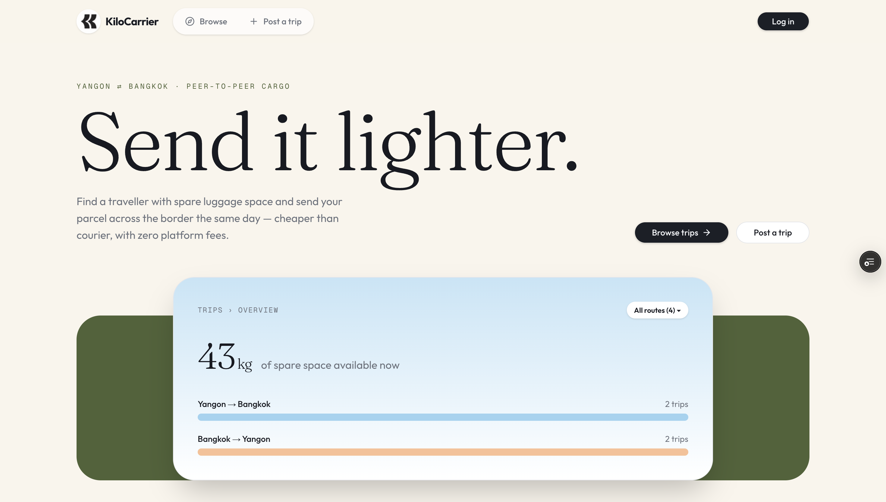
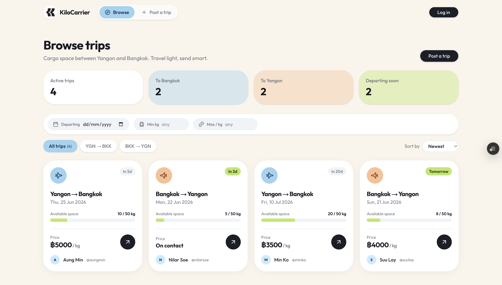
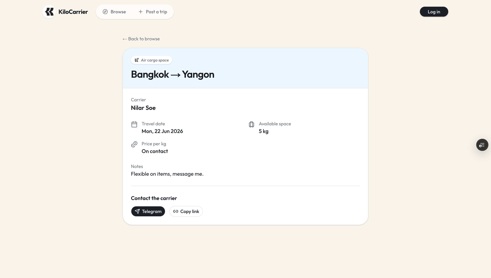
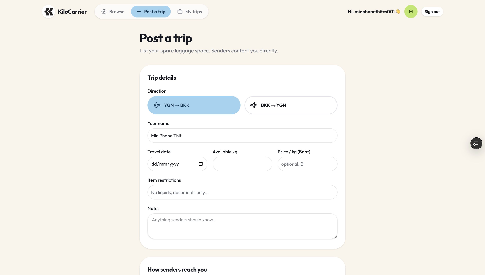
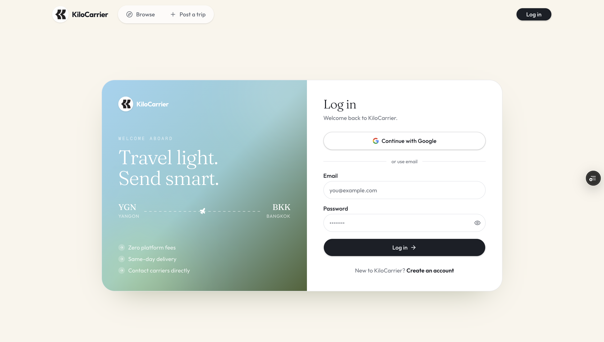

# KiloCarrier

**Travel light. Send smart.** — a peer-to-peer cargo marketplace connecting senders with travellers who have spare luggage space between **Yangon (YGN)** and **Bangkok (BKK)**.

Cheaper than courier, faster than cargo, with **zero platform fees** — carriers post their trips, senders browse and contact them directly on Telegram / WhatsApp / Viber / Facebook.



---

## What it does

- **Browse trips** — public, filterable listings of upcoming trips (direction, date, available kg, price/kg, sort).
- **Post a trip** — logged-in carriers list their spare luggage space (1–50 kg), price in **Thai Baht (฿)**, and contact handles.
- **Contact directly** — every listing exposes deep links: Telegram (required), WhatsApp, Viber, Facebook — plus a copy-link share button.
- **Manage listings** — carriers can edit and delete their own trips from *My trips*.
- **Auth** — email/password + Google OAuth (Supabase Auth).

Trips auto-expire after their travel date (filtered by `expiresAt > now()`).

### Screens

| Browse | Trip detail |
|---|---|
|  |  |

| Post a trip | Create account |
|---|---|
|  |  |

---

## Tech stack

- **Framework** — [Next.js 16](https://nextjs.org) (App Router, TypeScript, React 19)
- **Styling** — Tailwind CSS v4 + [shadcn/ui](https://ui.shadcn.com); Fraunces + Outfit type
- **Database** — [Prisma 6](https://www.prisma.io) → Supabase Postgres (via connection poolers)
- **Auth** — Supabase Auth (email/password + Google OAuth) via `@supabase/ssr`
- **Validation** — React Hook Form + Zod (every form)
- **Hosting** — Vercel (functions pinned to `sin1`, co-located with the DB)

## Architecture notes

- **DB access is Prisma only** (`src/lib/prisma.ts`); reads in Server Components, writes in Server Actions.
- **Auth is Supabase**; `src/proxy.ts` guards `/post` and `/my-trips`.
- Prisma connects through the pooler as the `postgres` role, which **bypasses RLS** — so ownership is enforced in server actions (the session user must own a trip to edit/delete it).
- Listings are cached with `unstable_cache` (tag `trips`, 60s) and busted via `revalidateTag` on create/edit/delete, so navigation rarely hits the DB.

## Routes

| Route | Purpose | Auth |
|-------|---------|------|
| `/` | Landing page | public |
| `/browse` | Filterable trip listings | public |
| `/trips/[id]` | Trip detail + contact links | public |
| `/trips/[id]/edit` | Edit a trip | owner |
| `/post` | Post a trip | required |
| `/my-trips` | Manage your trips | required |
| `/login` | Sign in / create account | public |

## Data model — `trips`

| column | type | notes |
|--------|------|-------|
| id | uuid | PK |
| userId | uuid | owner (Supabase auth user) |
| direction | enum | `YGN_TO_BKK` \| `BKK_TO_YGN` |
| travelDate | date | |
| availableKg | decimal | 1–50 |
| pricePerKg | decimal? | Thai Baht, optional |
| itemRestrictions | text? | |
| telegram | text | **required** contact |
| facebook / viber / whatsapp | text? | optional contacts |
| notes | text? | |
| createdAt | timestamptz | |
| expiresAt | timestamptz | = travel date end-of-day |

---

## Getting started

```bash
# 1. install
npm install

# 2. env (see below) — create .env and .env.local

# 3. push the schema to your Supabase Postgres
npm run db:push

# 4. run
npm run dev          # http://localhost:3000
```

### Environment variables

**`.env`** (Prisma — reads this file, not `.env.local`):

```bash
DATABASE_URL="postgresql://postgres.<ref>:<pwd>@<region>.pooler.supabase.com:6543/postgres?pgbouncer=true"
DIRECT_URL="postgresql://postgres.<ref>:<pwd>@<region>.pooler.supabase.com:5432/postgres"
```

**`.env.local`** (Next.js / Supabase Auth):

```bash
NEXT_PUBLIC_SUPABASE_URL="https://<ref>.supabase.co"
NEXT_PUBLIC_SUPABASE_ANON_KEY="<publishable key>"
NEXT_PUBLIC_SITE_URL="http://localhost:3000"
```

> Set up Google OAuth in Supabase → Authentication → Providers, and add your site URL(s) to the redirect allow-list.

### Scripts

| Script | Action |
|--------|--------|
| `npm run dev` | Start the dev server |
| `npm run build` | Production build |
| `npm run db:push` | Push Prisma schema to the DB |
| `npm run db:studio` | Open Prisma Studio |

---

## Deploy (Vercel)

1. Import the repo on Vercel (framework auto-detected).
2. Add env vars: `DATABASE_URL`, `DIRECT_URL`, `NEXT_PUBLIC_SUPABASE_URL`, `NEXT_PUBLIC_SUPABASE_ANON_KEY`, `NEXT_PUBLIC_SITE_URL` (= your Vercel domain).
3. `prisma generate` runs automatically on install (`postinstall`).
4. Functions deploy to `sin1` (Singapore) via `vercel.json`, next to the database.
5. In Supabase → Authentication → URL Configuration, set the Site URL and add `https://<your-domain>/**` to redirects.

---

_KiloCarrier is a listing/discovery platform — it does not handle payments or in-app messaging; senders and carriers transact directly._
